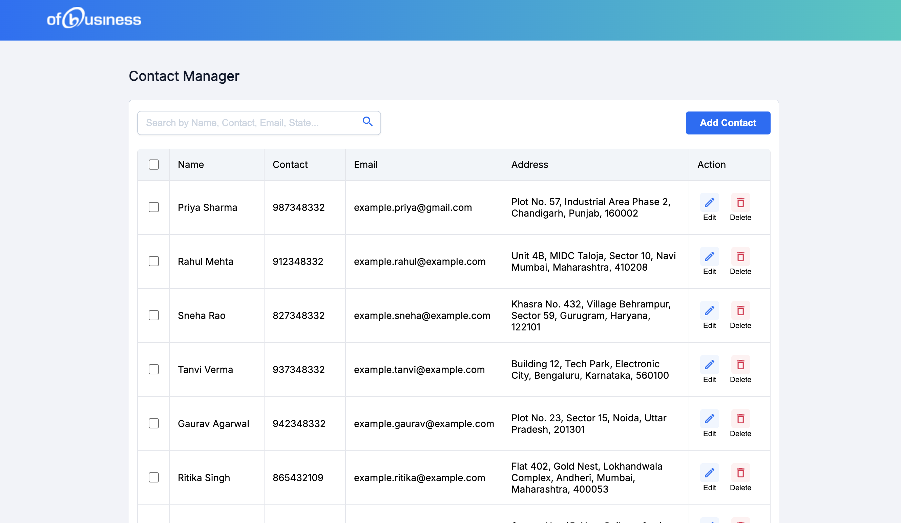
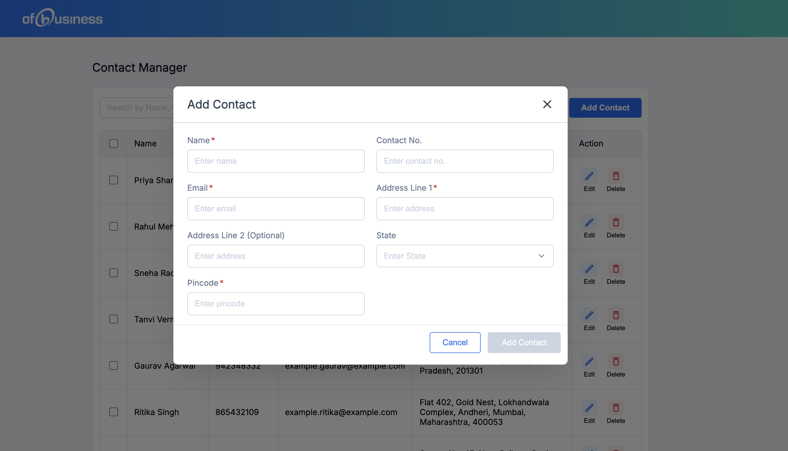
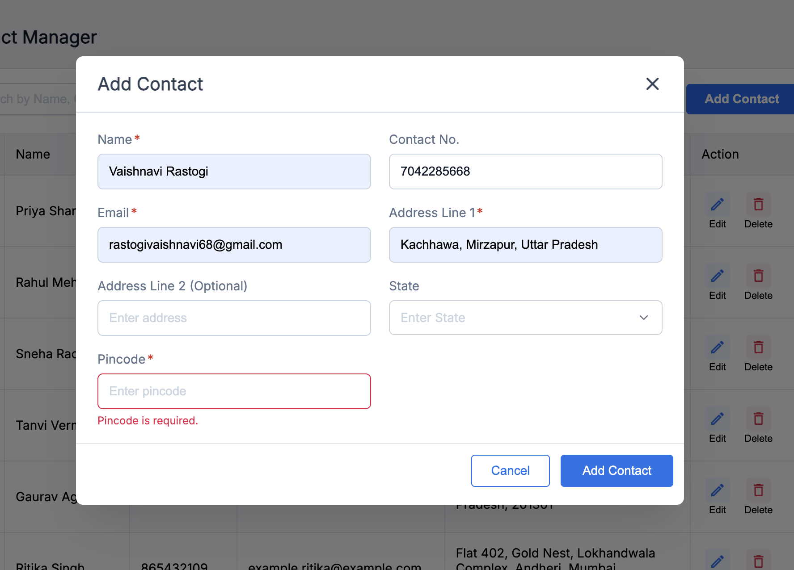
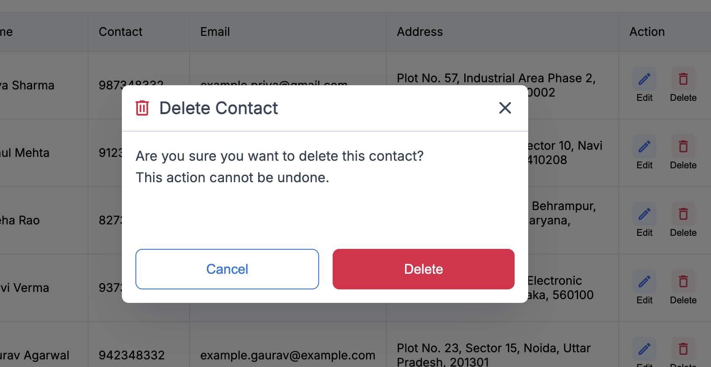
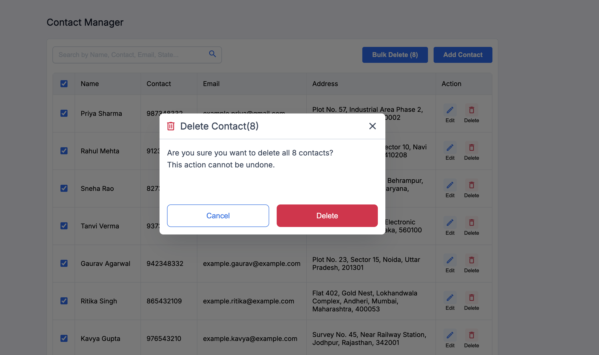
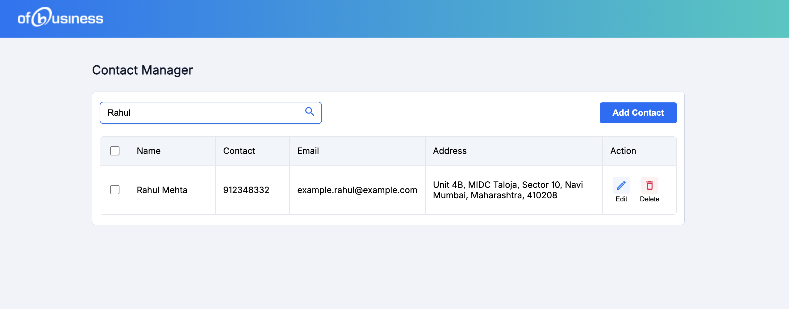
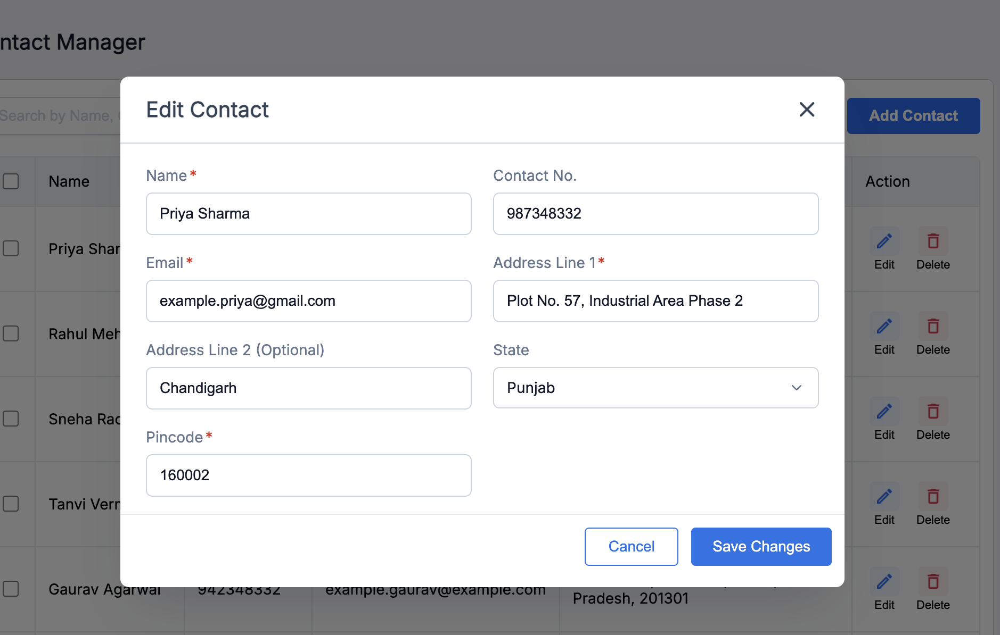

# Contact Manager App

This guide provides steps to install and run the Contact Manager application built with React, TypeScript, and Vite.

## Prerequisites

Ensure you have the following installed on your system:

- [Node.js](https://nodejs.org/) (LTS version recommended)
- [npm](https://www.npmjs.com/) or [yarn](https://yarnpkg.com/)

## Installation

1. Clone the repository:

```bash
git clone https://github.com/iScreenager/contactmanager.git
cd contactmanager
```

2. Install dependencies:

```bash
npm install
```

or

```bash
yarn install
```

## Running the Application

1. Start the development server:

```bash
npm run dev
```

or

```bash
yarn dev
```

2. Open your browser and navigate to the URL displayed in the terminal (e.g., `http://localhost:5173`).

## Building for Production

To create a production build, run:

```bash
npm run build
```

or

```bash
yarn build
```

The build artifacts will be available in the `dist` folder.

## Pending Items From Bonus

These three things are pending from bonus items:

- Animations/transitions for modal open/close and list actions
- Toast notifications for success or error (e.g., on add/delete)
- Persist contacts using localStorage

## Screenshots

Here are some screenshots of the application:














